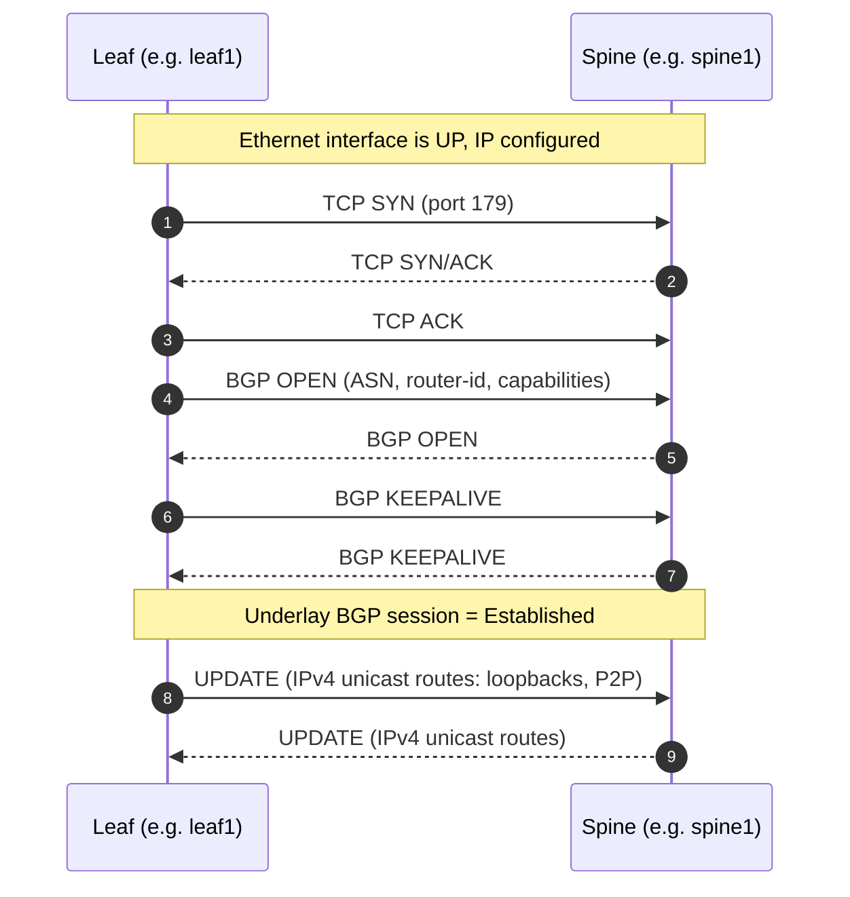
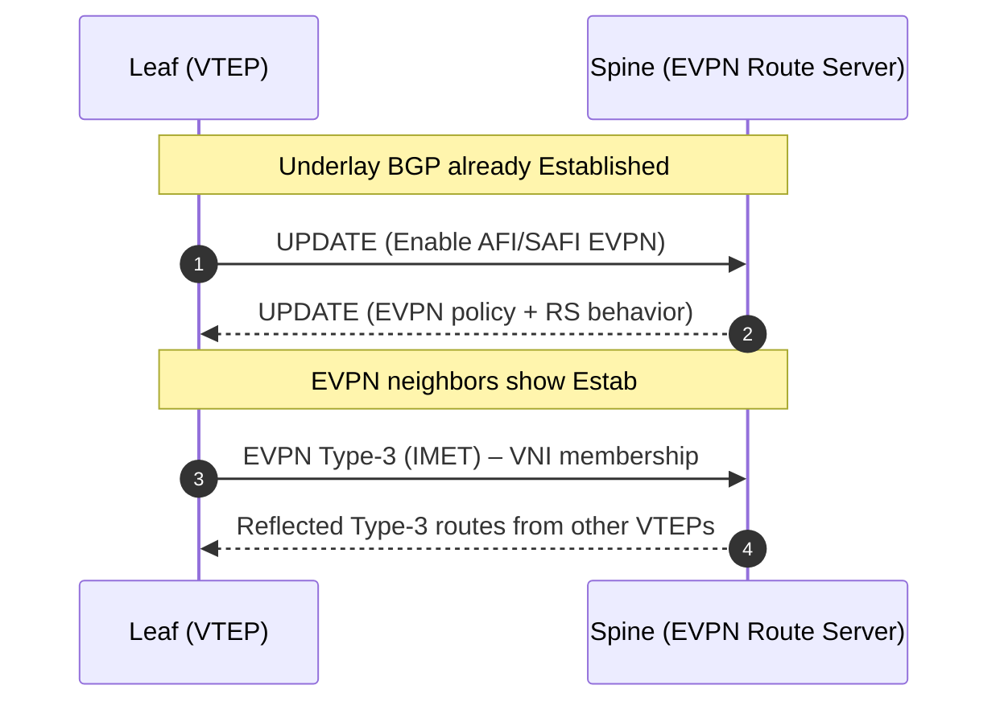
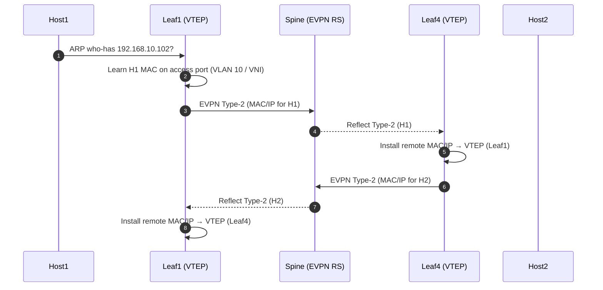
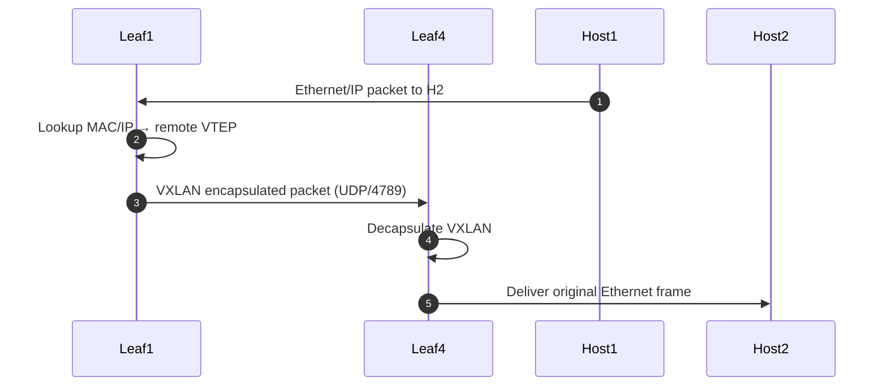

# EVPN Control Plane (Deep Dive)

This document provides a **complete, self-contained explanation** of the EVPN/VXLAN
control plane used in this lab. It is intended to be readable on its own and suitable
for publication via MkDocs or GitHub Pages.

---

## Scope of This Document

This lab implements:
- eBGP underlay (IPv4 unicast)
- EVPN overlay (AFI/SAFI EVPN)
- VXLAN data plane
- Spine-based EVPN route-server design

The sequence below matches what you will observe on Arista EOS using
`show bgp`, `show vxlan`, and related commands.

---

## High-Level Control Plane Flow

1. Physical links come up
2. Underlay eBGP sessions establish
3. EVPN address-family sessions establish
4. VTEPs advertise VNIs (Type-3)
5. Hosts trigger MAC/IP advertisements (Type-2)
6. Data plane forwarding begins using VXLAN

---

## 1. Underlay eBGP Session Establishment

The underlay provides IP reachability between VTEPs.



### Validation Commands (EOS)

```text
show ip bgp summary
show ip route
show interfaces status
```

---

## 2. EVPN Address-Family Establishment

Once underlay BGP is established, the EVPN AFI/SAFI becomes active.



### What Type-3 (IMET) Means
- Signals that a VTEP participates in a VNI
- Enables BUM (broadcast, unknown unicast, multicast) handling
- Required before host MAC learning works correctly

### Validation Commands

```text
show bgp evpn summary
show bgp evpn route-type imet
```

---

## 3. Host Learning and EVPN Type-2 Routes

When a host sends traffic, the leaf learns the MAC/IP and advertises it.



### What Type-2 Routes Carry
- MAC address
- Optional IP address
- VNI
- Next-hop = VTEP loopback IP

### Validation Commands

```text
show bgp evpn route-type mac-ip
show mac address-table
show ip arp
```

---

## 4. VXLAN Data Plane Forwarding

Once both sides have MAC/IP mappings, traffic is forwarded using VXLAN.



### Outer vs Inner Headers
- **Inner frame**: original host Ethernet/IP
- **Outer packet**: IP/UDP between VTEP loopbacks (UDP port 4789)

---

## Common Failure Patterns

### Underlay Issues
- Interfaces down
- IP addressing errors
- ASN mismatch
- TCP/179 blocked

### EVPN Issues
- EVPN AF not enabled
- Route-policy blocking EVPN routes
- Spine not acting as route server
- Missing Type-3 routes

### Data Plane Issues
- VLAN/VNI mismatch
- MTU too small for VXLAN
- Missing loopback reachability
- SPAN mirroring wrong interface (for visibility)

---

## Quick Troubleshooting Checklist

```text
show ip bgp summary
show bgp evpn summary
show bgp evpn route-type imet
show bgp evpn route-type mac-ip
show vxlan vtep
show interfaces vxlan 1
```

---

## Notes for This Lab

- Spines act as **EVPN route servers**
- Leafs act as **VXLAN VTEPs**
- Hosts generate continuous traffic to validate control + data plane
- SPAN on leaf1 mirrors traffic for ntopng visibility

---

_End of document_
