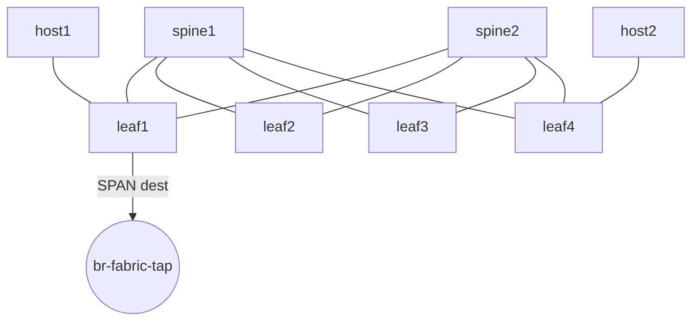

# Fabric Lab

This page documents the **EVPN/VXLAN fabric lab** defined in `topology.fabric.yaml`.

---

## Overview

The fabric lab implements a **Clos-style EVPN/VXLAN fabric** using Arista cEOS:

- **2× Spines** acting as EVPN route servers
- **4× Leafs** acting as VXLAN VTEPs
- **2× Linux hosts** for traffic generation
- **Anycast gateway (VARP)** for VLAN 10
- **SPAN tap** exporting real traffic to the management lab

---

## Nodes

### Spines
| Node | Role | Notes |
|----|----|----|
| `spine1` | EVPN route server | eBGP underlay |
| `spine2` | EVPN route server | eBGP underlay |

### Leafs
| Node | Role | Notes |
|----|----|----|
| `leaf1` | VTEP + SPAN source | SPAN destination on `Ethernet5` |
| `leaf2` | VTEP | — |
| `leaf3` | VTEP | — |
| `leaf4` | VTEP | Anycast gateway peer |

### Hosts
| Host | Attached To | IP |
|----|----|----|
| `host1` | `leaf1:eth10` | 192.168.10.101/24 |
| `host2` | `leaf4:eth10` | 192.168.10.102/24 |

---

## Topology



---

## Underlay & Overlay

### Underlay
- eBGP between leafs and spines
- Each leaf has uplinks to both spines
- Point-to-point routed interfaces

### Overlay
- EVPN address family
- VXLAN encapsulation
- VLAN 10 stretched across leafs
- Anycast gateway using VARP on `leaf1` and `leaf4`

---

## SPAN / Traffic Tap

To export **real fabric traffic** to ntopng:

- `leaf1:Ethernet5` is connected to the host Linux bridge `br-fabric-tap`
- Traffic is mirrored using EOS SPAN

### Example EOS SPAN config

```eos
monitor session 1
  source interface Ethernet1
  source interface Ethernet2
  source interface Ethernet10
  destination interface Ethernet5
```

You may also mirror:
- VLAN 10
- Port-Channels
- All interfaces

> ⚠️ Without SPAN configured, ntopng will see **no traffic**.

---

## Validation

Useful checks on leafs/spines:

```bash
show bgp evpn summary
show vxlan vtep
show ip route
```

---

## Notes

- The fabric lab can be deployed and destroyed independently
- Management services are **not** part of this lab
- `br-fabric-tap` must exist before deployment
