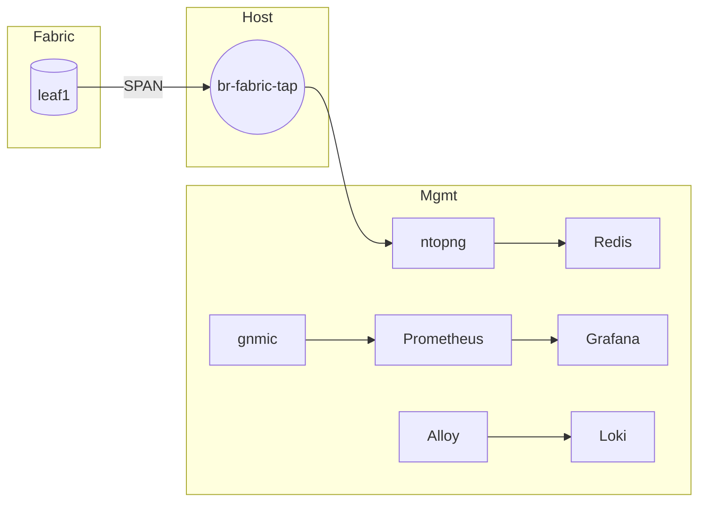

# Management Lab

This page documents the **management / observability lab** defined in
`topology.mgmt.yaml`.

The management lab is deployed **after** the fabric converges and is fully
independent from the data plane, except for **ntopng**, which receives real
mirrored traffic via a tap bridge.

---

## Overview

The management lab provides:

- Telemetry collection (gNMI)
- Metrics storage and visualization
- Centralized logging
- Flow and packet visibility using **real fabric traffic**

All components connect via the Docker management network `clab-mgmt`.

---

## Components

### gnmic
- Collects gNMI telemetry from Arista devices
- Exports metrics in Prometheus format
- Acts as the single telemetry collector

### Prometheus
- Scrapes gnmic metrics
- Stores time-series telemetry
- Feeds Grafana dashboards

### Grafana
- Visualizes metrics and logs
- Pre-provisioned dashboards and datasources
- Default credentials: `admin / admin`

### Alloy
- Receives syslog from network devices
- Forwards logs to Loki
- Optional HTTP debug endpoint

### Loki
- Log storage backend
- Queried by Grafana for log analysis

### Redis
- Backend datastore for ntopng
- Required for ntopng operation

### ntopng
- Network traffic analysis
- Captures **real mirrored fabric traffic**
- Web UI exposed via port forwarding

---

## Network Interfaces

### ntopng Interfaces

| Interface | Purpose |
|--------|---------|
| `eth0` | Management (Docker `clab-mgmt`) |
| `eth1` | Tap interface (`br-fabric-tap`) |

`eth1` receives mirrored packets from `leaf1` via SPAN.

---

## Topology

---

## Access URLs

| Service | URL |
|------|-----|
| Grafana | http://localhost:3000 |
| Prometheus | http://localhost:9090 |
| ntopng | http://localhost:3001 |
| gnmic exporter | http://localhost:9804 |

---

## Notes

- The management lab can be redeployed independently
- Restarting management containers does **not** impact the fabric
- ntopng visibility depends entirely on EOS SPAN configuration
